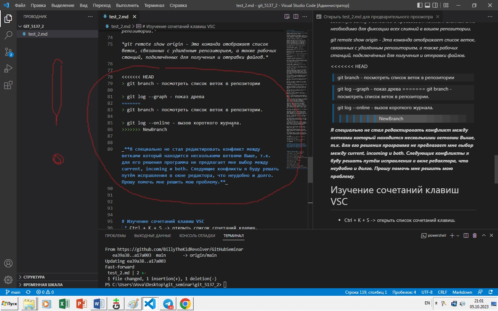

## Основные команды Git 1-го семинара

> **git init** - создание локального репозитория

> **git status** - получить информацию от git о его текущем состоянии

> **git add** - добавить файл или файлы к следующему коммиту

> **git commit** -m “message” – создание коммита.

> **git log** – вывод на экран истории всех коммитов с их хеш-кодами

> **git checkout** – переход от одного коммита к другому

> **git checkout master** – вернуться к актуальному состоянию и продолжить работу

> **git diff** – увидеть разницу между текущим файлом и закоммиченным файлом

## Основные команды Git 2-го семинара

> git branch **<branch_name>** - создать новую ветку с именем branch_name

> **git checkout  -b <branch_name>** - создание ветки и переход к ней

> **git commit -am “message”** – добавление файлов в отслеживание и       создание коммита.
> **git log --graph** - вывод на экран истории всех коммитов с их хеш-кодами в древовидной форме

## Основные команды Git 3-го семинара

> **git clone <url-адрес репозитория>** – клонирование внешнего репозитория на  локальный ПК

> **git pull** – получение изменений и слияние с локальной версией

> **git push** – отправляет локальную версию репозитория на внешний

> **git clone <url-адрес репозитория> – клонирование внешнего репозитория на
локальный ПК

> **git pull – получение изменений и слияние с локальной версией

> **git push – отправляет локальную версию репозитория на внешний

It is my little ~~pony~~ problem

[Это моя проблема it is my little problem](conflict.jpg)

Почему в строках 46 и 48 всё именно так? В строке 46 нет фото потому что нет знака "!", но почему в строке 48 нет текста